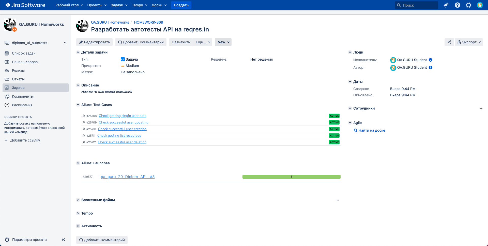
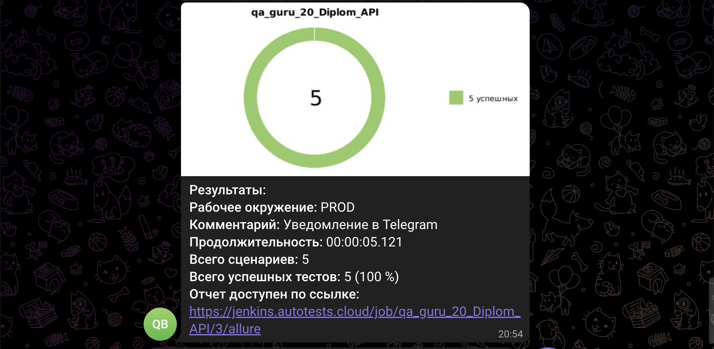

# Демопроект автоматизации тестирования API на reqres.in
<p align="center">


## :scroll: Содержание:

- [Используемый стек](#computer-используемый-стек)
- [Тест-кейсы](#heavy_check_mark-тест-кейсы)
- [Запуск автотестов](#arrow_forward-запуск-автотестов)
- [Сборка в Jenkins](#-сборка-в-jenkins)
- [Отчет о результатах тестирования в Allure Report](#-отчет-о-результатах-тестирования-в-allure-report)
- [Интеграция с Allure TestOps](#-интеграция-с-allure-testops)
- [Интеграция с Jira](#-интеграция-с-jira)
- [Интеграция с Telegram](#-интеграция-с-telegram)

## :computer: Используемый стек

<p align="center">


</p>

## :heavy_check_mark: Тест-кейсы
* Получение данных пользователя;
* Проверка получения списка ресурсов;
* Создание нового пользователя;
* Обновление данных пользователя;
* Удаление пользователя.

## :arrow_forward: Запуск автотестов

### Удаленный запуск тестов из терминала
```
gradle clean test
```
##  Сборка в Jenkins

Для запуска [сборки](https://jenkins.autotests.cloud/job/qa_guru_20_Diplom_API/) необходимо перейти в раздел <code>Собрать с параметрами</code>, указать нужные параметры и нажать кнопку <code>Собрать</code>.
<p align="center">

</p>

##  Отчет о результатах тестирования в [Allure Report](https://jenkins.autotests.cloud/job/qa_guru_20_Diplom_API/)

### Основная страница отчета

<p align="center">

</p>

### Тест-кейсы

<p align="center">


##  Интеграция с [Allure TestOps](https://allure.autotests.cloud/project/3647/dashboards)

### Dashboards

<p align="center">

</p>

### Тест-кейсы

<p align="center">

</p>

##  Интеграция с [Jira](https://jira.autotests.cloud/browse/HOMEWORK-869)

Реализована интеграция <code>Allure TestOps</code> с <code>Jira</code>, в тикете отображается, какие тест-кейсы были написаны в рамках задачи и результат их прогона.

<p align="center">

</p>

##  Интеграция с Telegram

После завершения сборки бот автоматически отправляет сообщение в <code>Telegram</code> с отчетом о прогоне тестов.

<p align="center">

</p>
